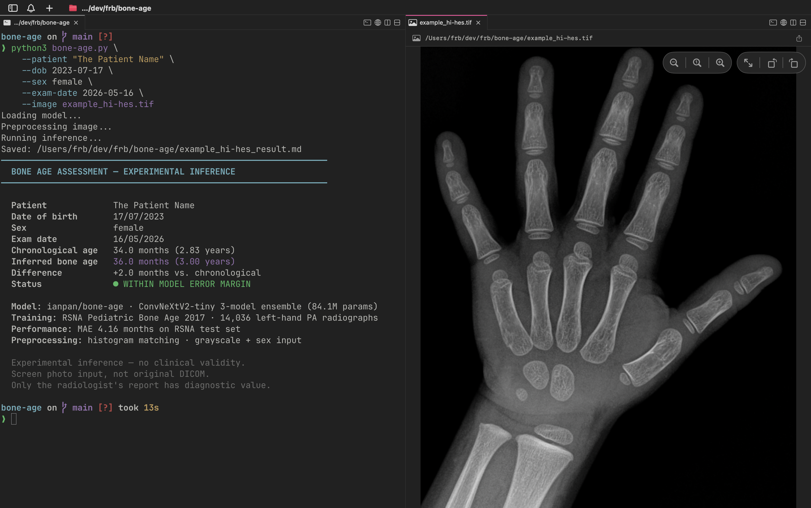

# Bone Age

Bone age assessment from hand radiographs using the [ianpan/bone-age](https://huggingface.co/ianpan/bone-age) deep learning model — a ConvNeXtV2-tiny 3-model ensemble trained on the RSNA Pediatric Bone Age 2017 dataset (14,036 left-hand PA radiographs, MAE 4.16 months).

<p align="center">
  
</p>

## Disclaimer

**Experimental — not clinically validated.** Built as an engineering exercise to explore medical imaging inference. Only a radiologist's report has diagnostic value. Do not use for medical decisions.

## Why this model

The original [Deeplasia](https://github.com/aimi-bonn/Deeplasia) paper was the first choice, but the authors never published the pretrained checkpoints. `ianpan/bone-age` is a public alternative trained on the same RSNA dataset with comparable performance (MAE 4.16 vs. Deeplasia's 3.87 months) and includes native DICOM support.

## Image requirements

- **Left hand**, PA view, fingers up — matches training distribution
- All 5 fingers visible, wrist included, forearm cropped
- Manual crop recommended over the model's auto-crop (which can clip the thumb on rotated images)
- Screen photos work but degrade accuracy vs. original DICOM (gamma, glare, JPEG artifacts)

## Install

```bash
pip install -r requirements.txt
```

## Usage

```bash
python bone-age.py \
  --patient "Patient Example" \
  --dob 2023-07-17 \
  --sex female \
  --image example.tif
```

| Flag | Default | Description |
|------|---------|-------------|
| `--patient` | `Patient Example` | Patient name or identifier |
| `--dob` | `2023-07-17` | Date of birth (`YYYY-MM-DD`) |
| `--sex` | `female` | `male` or `female` |
| `--exam-date` | today | Exam date (`YYYY-MM-DD`) |
| `--image` | `example.tif` | Path to hand X-ray image (PNG/TIFF) |

The script preprocesses the image via histogram matching against the model's reference, runs inference, saves `{image}_result.md` to disk, and prints the report to the terminal.

## Model

| Detail | Value |
|--------|-------|
| Architecture | ConvNeXtV2-tiny 3-model ensemble |
| Parameters | 84.1M |
| Training data | RSNA Pediatric Bone Age 2017 |
| Training samples | 14,036 left-hand PA radiographs |
| MAE | 4.16 months (RSNA test set) |
| Input | 1-channel grayscale + sex |
| Preprocessing | Histogram matching |

## Notes on accuracy

- Bone age ≠ chronological age is normal in healthy children (±12 months variation)
- The model is sensitive to input quality — bad crop or skipped histogram matching can shift predictions by 10+ months
- This pipeline uses CPU inference (sufficient for single images)

## License

MIT